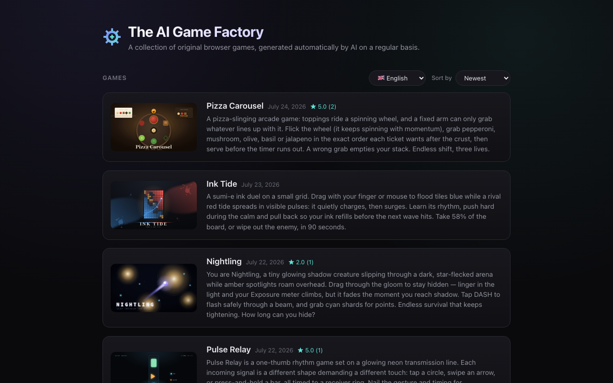

<h1 align="center">The AI Game Factory</h1>

A collection of original, AI-generated, browser-game prototypes.

  

## Contents

- [Main features and functionalities](#main-features-and-functionalities)
- [Purpose of this project](#purpose-of-this-project)
- [Main parts of the project](#main-parts-of-the-project)
- [Potential Future Directions (currently out of scope)](#potential-future-directions-currently-out-of-scope)

# Main features and functionalities

- Each game is a single-page, self-contained HTML file — no build step, no dependencies, just open it in a browser
- Every game is designed mobile-first: controls are touch-only (tap/swipe/drag/hold), no keyboard or mouse required
- Every game ships with a companion design doc describing its pitch, controls, core mechanics, and win/lose conditions
- Games are built through a staged pipeline — mechanics first, then visual polish, then difficulty tuning — each stage recorded as its own section in the game's design doc
- New games get promotional thumbnails and a listing on the root landing page, so the collection is directly browsable/playable from `index.html`
- The landing page itself is dynamic: it fetches its game list from a small Cloudflare Worker API (`GET /games`) instead of hardcoded HTML, kept in sync with `games/` by a CI step on every deploy
- Each game is played through a small wrapper page with a 1-5 star rating bar; ratings are aggregated across visitors (via the same Worker), and the homepage can be sorted by Newest or Best Rated
- New games are added as dated folders, so the collection doubles as a timeline of prototypes
- A scheduled automation loop generates and publishes new games on its own, on a recurring cadence, with no human review in the loop — gated by an automated smoke check before anything ships, and able to resume from where it left off if interrupted partway through (e.g. a usage limit) instead of losing the run

# Purpose of this project

This project is a personal experiment, built for fun, to learn how AI agents and multi-agent pipelines actually work in practice — not a commercial product. The games themselves are a vehicle; the real subject under test is the orchestration behind them: how to decompose a task into specialist subagents, restrict each one's tools and responsibilities, pass state between them without shared conversation history, and let an orchestrator drive the whole thing end to end with minimal human intervention.

Concretely, the project showcases a simple generative AI workflow — game concept → mechanics → visual design → difficulty tuning → promotional art → localized copy → site listing — where each stage is a purpose-built Claude Code subagent that only ever edits the output of the one before it. A few things it demonstrates reasonably well:

- **Narrow, single-responsibility agents.** Each subagent (`game-creator`, `game-polisher`, `game-balancer`, `game-thumbnailer`, `game-describer`, `game-editor`) does exactly one job and is denied the tools/scope it doesn't need, instead of one general-purpose agent doing everything.
- **Shared memory through artifacts, not chat history.** Each stage reads and appends to the game's `GAME.md`, so a subagent never needs the previous stage's conversation — just its written output. State lives in the repo, not in a prompt.
- **A deliberately sequential pipeline with hard stops.** Stages run strictly in order because each depends on the last, and the orchestrator (`game-producer`) halts the whole pipeline if any stage reports an unresolved bug, rather than letting later stages build on a broken foundation.
- **Zero-dependency, zero-build output.** Every game is a single inlined HTML file with no external calls, which keeps each pipeline run self-contained and trivially verifiable by just opening the file.
- **A fully autonomous release loop, resilient to real-world interruption.** A scheduled job (see `scripts/`) checks out the repo, runs the same `game-producer` pipeline a human would trigger by hand, gates the result behind an automated headless smoke check, then opens and merges its own pull request — closing the loop from idea to live deploy with no human intervention. It also checkpoints its progress to disk at every pipeline stage and, if a run gets cut off mid-way (e.g. a subscription usage limit), the next scheduled firing detects the unfinished branch and resumes from the last completed stage instead of losing the work — a small but real lesson in designing for a process that can die at any point.
- **A judgment-gated quality check, not just a pass/fail one.** Before publishing, `game-producer` runs `game-qa` — a real headless playtest that actually drives the game's touch/pointer gestures in a browser, not a static read of the code — then decides for itself whether what it found is worth fixing, invoking `game-editor` only when the evidence warrants it (a real bug or usability problem) rather than on every stylistic nitpick, and re-verifies the fix with one more `game-qa` pass before moving on.
- **Self-reported cost per run.** Every subagent invocation's model and token usage gets recorded in a `Pipeline Token Usage` table appended to that game's own `GAME.md`, so the pipeline's resource cost is tracked alongside its output, not left opaque. Model choice itself is a deliberate, permanent default per agent (not a per-run override) — settled after empirically comparing Sonnet/Opus/Fable as playtesters on a real shipped game, and ultimately favoring the model that keeps the autonomous run inside its subscription usage allowance over the one with marginally sharper QA judgment.

# Main parts of the project

- `index.html` — the landing page; fetches and renders the game list dynamically from the Cloudflare Worker's `GET /games` rather than hardcoding it
- `play.html` — the generic per-game player page (`?slug=`); shows the star rating bar and loads the actual game in an iframe
- `games/` — one subfolder per game, named `YYYY_MM_DD_game_title`
  - `index.html` — the playable game (HTML, CSS, and JS in one file)
  - `GAME.md` — the design doc: pitch, controls, mechanics, win/lose conditions, plus sections appended by each pipeline stage (visual design, difficulty tuning, edit log, assets)
  - `thumbnails/` — promotional artwork for the landing page and social previews (small/medium/large PNGs)
- `cloudflare/` — the Worker (`worker.js`) and its config (`wrangler.toml`) backing `GET /games` and the `GET /ratings` / `POST /ratings/:slug` rating endpoints; `scripts/build_games_json.mjs` rebuilds the game data it serves from `games/*/` on every deploy
- `.claude/agents/` — the specialist subagents that build and maintain games: `game-producer` (orchestrates the full pipeline), `game-creator` (mechanics/prototype), `game-polisher` (visual design), `game-balancer` (difficulty pacing), `game-qa` (headless playtesting — actually plays the finished game in a real browser and reports bugs/issues with evidence, never edits anything), `game-thumbnailer` (promotional art), and `game-editor` (scoped one-off edits to an existing game, outside the creation pipeline — also invoked by `game-producer` itself, conditionally, when `game-qa` flags something worth fixing before publishing). Every agent's model is a permanent default in its own file, not something re-specified per run.
- `scripts/` — everything driving the unattended release loop: `weekly_autonomous_run.sh` (the cron entrypoint) and `weekly_prompt.md` (the self-contained instructions it feeds Claude Code headlessly, including detecting and resuming an interrupted run), plus `smoke_check.mjs` (the pre-publish headless browser check) and `build_games_json.mjs` (the landing-page data sync, above)
- `CLAUDE.md` — project-level instructions for Claude Code, describing the pipeline and repo conventions in detail

# Potential Future Directions (currently out of scope)

The following are ideas for extending this experiment further, kept here as notes rather than commitments — they're deliberately not being worked on right now, but they'd be the natural next steps if this project continues:

- **Runtime AI, not just build-time AI.** So far the games are _built_ by AI but contain none at runtime. A future game could call an LLM live (a generated-dialogue NPC, a dynamic narrator) to explore prompting under real constraints like latency and cost.
- **An MCP server alongside the plain REST API.** The landing page now reads its game list from a small Cloudflare Worker (`GET /games`) instead of hand-edited HTML, but that's a plain REST endpoint. Exposing the same data as `list_games` / `get_game` MCP tools would be a natural way to learn the MCP protocol on top of infrastructure that already exists.
- **A feedback loop from live usage back into the agents.** The site now collects real signal (1-5 star ratings per game, via the Cloudflare Worker), but nothing reads it yet — the pipeline still runs once per game and stops. An "analyst" agent that watches ratings trends and proposes tuning changes to `game-balancer` (or flags a poorly-rated game for a `game-editor` pass) would turn this into an actual closed loop instead of a one-shot generation.
